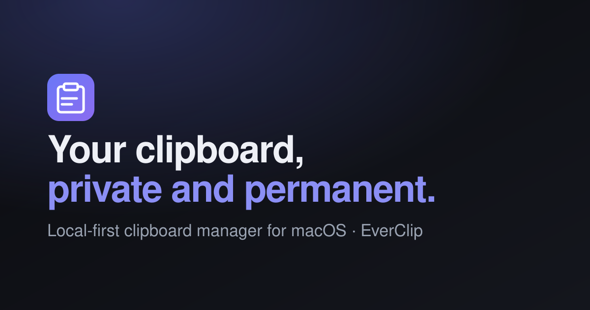

<p align="center">
  
</p>

<h1 align="center">EverClip</h1>

<p align="center">
  A local-first “perpetual clipboard” for macOS.<br>
  Everything you copy — text, links, images, screenshots, files — captured, searchable, and kept <em>forever</em>, entirely on your Mac.
</p>

<p align="center">
  <a href="#install">Install</a> ·
  <a href="#features">Features</a> ·
  <a href="#privacy">Privacy</a> ·
  <a href="#architecture">Architecture</a> ·
  <a href="#roadmap">Roadmap</a>
</p>

---

## Why

The macOS clipboard holds exactly one thing. The moment you copy again, whatever
was there is gone. EverClip fixes that: it watches the pasteboard, records every
copy locally, and lets you search your entire history and paste anything back with
a keystroke — while keeping your data on your own machine.

## Features

- **Unlimited, deduplicated history** — text, rich text, links, images,
  screenshots and files, newest first. Copying the same thing again just floats
  the existing entry to the top instead of creating duplicates.
- **Type badges & previews** — every item is classified (Text / Rich Text / Link /
  Image / Screenshot / File) with an inline preview and image thumbnails.
- **Pinned top strip** — the 10 most recent items in a horizontal strip across the
  top for one-click access.
- **Recent & Favorites tabs** — pin anything you reach for constantly; favorites
  are never pruned.
- **Instant full-text search** — SQLite **FTS5** index with prefix matching and a
  filter by type.
- **Paste-back** — open with the global hotkey **⌥⌘V**, pick an item (click, `Enter`,
  or `⌘1`–`⌘9`), and it pastes straight into the app you were just in.
- **Retention** — keep by count, age, and/or total disk size; oldest non-favorites
  are pruned automatically.
- **Privacy & safety** — skips items flagged concealed/transient (password
  managers), a per-app exclude list, a global pause toggle, per-item delete, and
  “clear all”.
- **Optional, opt-in backup** — periodic export to a folder, your own Google Drive,
  or your own Gmail. **Off by default**; nothing leaves your Mac unless you enable it.
- **Tasteful UI** — a native SwiftUI menu-bar app, light and dark.

## Privacy

**100% local. Your data stays on your Mac.**

- History lives in a local SQLite database and blob files under
  `~/Library/Application Support/EverClip`. No servers, no account, no telemetry.
- Content marked `org.nspasteboard.ConcealedType` / `TransientType` (used by
  password managers and similar) is **never** recorded.
- You can exclude specific apps, pause capture at any time, delete individual
  items, or clear everything.
- The optional export module is isolated and **disabled by default**. When enabled,
  it talks only to the destination *you* configure, using *your own* account.

## Install

> **Build requirement:** a full **Xcode 15+** toolchain on **macOS 13+**. The app’s
> UI is SwiftUI, whose compiler macros ship with Xcode (the standalone Command Line
> Tools are enough for the core library and tests, but not the app).

### Build from source

```bash
git clone https://github.com/Nihirdas/everclip.git
cd everclip
Scripts/build-app.sh release
open build/EverClip.app
```

Then:

1. Move `EverClip.app` to `/Applications`.
2. On first launch it lives in the menu bar (no Dock icon).
3. Grant **Accessibility** permission when prompted (System Settings → Privacy &
   Security → Accessibility) so EverClip can paste into other apps.
4. Optionally enable **Launch at login** in Settings.

You can also open the package in Xcode (`File ▸ Open…` → the repo folder) and run
the `EverClip` scheme.

## Usage

| Action | How |
| --- | --- |
| Open the panel | **⌥⌘V**, or click the menu-bar icon |
| Search | Just start typing |
| Move selection | `↑` / `↓` |
| Paste selected item | `Enter` or click |
| Paste a top-strip item | `⌘1`–`⌘9` |
| Pin / unpin | Star button on a row |
| Delete an item | Trash button on a row |
| Pause / resume | Footer toggle, or the menu-bar menu (right-click) |
| Settings | Gear icon, or right-click the menu-bar icon |

## Optional backup (opt-in)

Settings → **Backup**. Off by default. Add one or more destinations:

- **Folder** — copies a zipped archive to any folder. Point it at a **Google Drive**,
  **iCloud Drive**, or **Dropbox** synced folder to get off-machine backups with no
  OAuth at all.
- **Google Drive / Gmail** — uses **your own** Google OAuth client (bring your own
  credentials; nothing is bundled), with least-privilege scopes (`drive.file`,
  `gmail.send`). Refresh tokens are stored in the macOS Keychain.

<details>
<summary>Setting up your own Google OAuth client</summary>

1. In the [Google Cloud Console](https://console.cloud.google.com/), create a
   project and enable the **Google Drive API** and/or **Gmail API**.
2. Create an **OAuth client ID** of type **Desktop app**.
3. Paste the **client ID** and **client secret** into the destination in EverClip
   Settings. For Gmail, also set the recipient (your own address).
4. On first backup, your browser opens for a one-time consent; the token is saved
   to your Keychain.

</details>

Each export writes a `manifest.json` (portable metadata) plus, optionally, image
blobs — zipped into `EverClip-Export-<timestamp>.zip`.

## Architecture

The capture/store/search core is deliberately separate from the macOS UI so a
future Windows port can reuse the model.

```
Sources/
  EverClipCore/        # platform-independent, AppKit-free, unit-tested
    Models/            # ClipItem, ClipKind, ClipDraft, PasteboardSnapshot
    Classification/    # ClipClassifier, URL detection
    Store/             # GRDB + FTS5 schema, ClipStore, BlobStore, hashing
    Retention/         # RetentionPolicy (pure, testable pruning)
    Search/            # SearchQuery
    Settings/          # AppSettings + JSON SettingsStore
    Export/            # ExportTarget protocol, archive builder, local/Drive/Gmail
  EverClip/            # macOS menu-bar app (AppKit + SwiftUI)
    PasteboardMonitor  # NSPasteboard change-count polling (~0.3s)
    Hotkey/            # Carbon global hotkey
    Paste/             # CGEvent ⌘V paste-back
    Panel/ + Views/    # SwiftUI panel, top strip, rows, settings
```

- **Storage:** SQLite via **GRDB**; metadata + FTS5 full-text search in the DB,
  image/screenshot bytes as files on disk with generated thumbnails.
- **Export backends** sit behind a single `ExportTarget` protocol, so adding a new
  destination (S3, WebDAV, …) touches nothing else.

## Tests

The core is covered by unit tests (store CRUD, dedupe, retention/pruning, search,
classification, export archive):

```bash
swift test
```

> Tests use the [swift-testing](https://github.com/swiftlang/swift-testing)
> framework, so they run on the Command Line Tools toolchain too — no Xcode needed
> for the core.

## Roadmap

- [ ] Windows port (native WinUI/C#, or a shared Rust core) reusing the model
- [ ] More export backends behind `ExportTarget` (S3, WebDAV, Dropbox API)
- [ ] Customizable global hotkey UI
- [ ] Signed & notarized release builds (Developer ID)
- [ ] Optional on-device OCR to make image text searchable

## License

[MIT](LICENSE) © Nihir Das.

*Not affiliated with Apple. macOS is a trademark of Apple Inc.*
